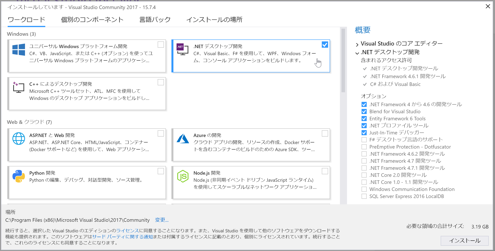
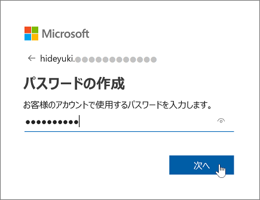
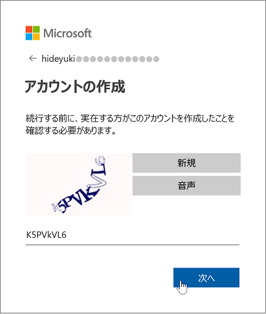
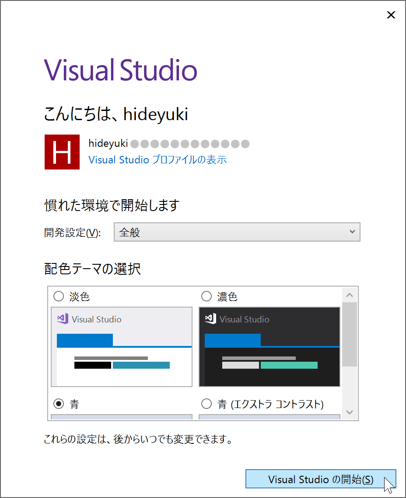

# Visual Studio Community 2017 のインストール手順

## はじめに

本手順は、書籍『新・標準プログラマーズライブラリ なるほどなっとくC#入門』(技術評論社)の読者のための補助資料として公開するものです。

本文では説明できなかった、Visual Studio Community 2017 のインストール方法について説明しています。

Visual Studio Community 2017は個人開発者や教育、学術研究用に無償で提供されるソフトウェアです。商用利用においては制限がありますので、<a href="https://visualstudio.microsoft.com/ja/license-terms/mlt553321/" target="_blank">ライセンス条項</a>をお確かめの上、インストールしてください。

## Visual Studioインストール用プログラムをダウンロードし起動する

1. 以下のページにアクセスします。

    <a href="https://visualstudio.microsoft.com/ja/downloads" target="_blank">Visual Studio Downloads</a>

2. ダウンロードページの「コミュニティ」欄の\[無償ダウンロード\]ボタンをクリックします。

    

    例えば、Edgeの場合は、以下のようなダイアログが表示されますので、\[保存\]を選択し、プログラムをディスクに保存します。

    

3. ファイルをダウンロードしたら、ダウンロードしたプログラムを実行します。例えば、Edgeの場合は、以下のようなダイアログが表示されますので、\[実行\]を選択します。

    

## Visual Studioのインストールを開始する

4. ユーザーアカウント制御のダイアログが表示された場合は、\[はい\]をクリックします。

    

6. 「プライバシーに関する声明」と「Microsoftソフトウェアのライセンス条項」の確認を求められますので、確認した後、\[続行\]ボタンをクリックします。

    

7. Visual Studio Installerのダウンロードとインストールが開始されます。

    

## ワークロードを選択する

7. インストーラーが起動すると、ワークロードの選択画面が表示されます。この画面で、Visual Studioでどのような開発を行うかを指定します。

    

   例えば、Windows用のデスクトップアプリケーションの開発を行うならば「.NET デスクトップ開発」をチェックします。Webアプリケーションの開発を行う場合は「ASP.NETとWeb開発」をチェックします。ワークロードは複数選択することが可能です。 

   なお、書籍『新・標準プログラマーズライブラリ なるほどなっとくC#入門』に掲載されているプログラムコードを動かすには、「.NET デスクトップ開発」にチェックを入れてください。このワークロードはインストール後に追加することもできます[^1]。
   
8. 必要なワークロードを選択したら、画面右下の\[インストール\]ボタンをクリックします。

    

 
9. インストールか開始されます。Visual Studio のインストールの進行状況が示されます。インストールに要する時間は、選択するワークロードの数、コンピュータの性能、ネットワークの回線速度などにより異なってきます。環境によってはインストールに1時間以上かかる場合もあります。

    

## Visual Studio にサインインする

10. インストールが完了すると、自動的にVisual Studio が起動し「ようこそ」の画面が表示されます。

    

    Microsoftアカウントをお持ちの方は、\[サインイン\]ボタンを押して、サインインして15へ進んでください。

    Microsoftアカウントをお持ちで無い方は、\[サインアップ\]のリンクをクリックしてください。

11. アカウント作成のウィンドウが表示されますので、ここで、あなたのメールアドレスを入力し、\[次へ\]ボタンをクリックします。

    

12. 次にパスワード作成のウインドウで、Microsoftアカウントのパスワードを入力し、\[次へ\]ボタンをクリックします。

    

13. 11で入力したメールアドレスにメールが届きます。メールに記載されている確認コードを入力し、\[次へ\]ボタンをクリックします。

    

14. アカウントの作成ウインドウが表示されます。画像に表示されている英数字の文字を入力欄に入力し、\[次へ\]ボタンをクリックします。

    

15. サインインが完了すると、下記のウインドウが表示されます。配色テーマの選択をし、\[Visual Studioの開始\]ボタンをクリックします。

    

16. Visual Studioが起動し、C#での開発が行えるようになります。

    

以上でインストールは完了です。

[^1]: ワークロードを後から追加するには、スタートメニューから\[Visual Studio Installer\]を開きます。 ここで、インストールするワークロードを選択し\[変更\]をクリックします。
