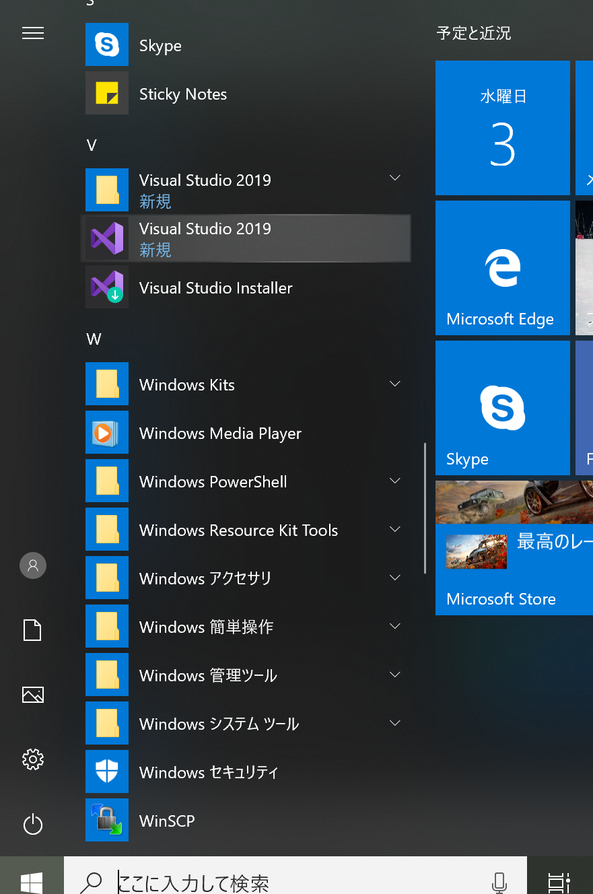
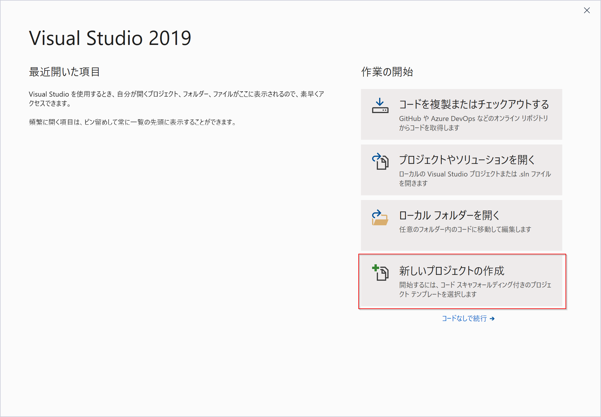
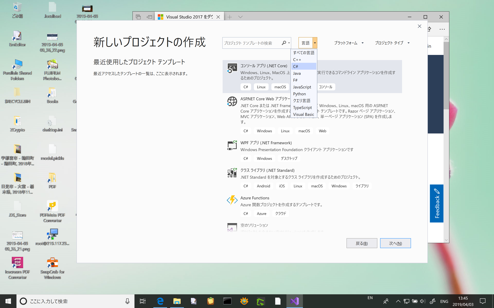
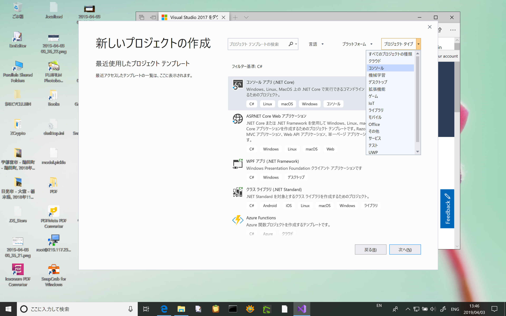
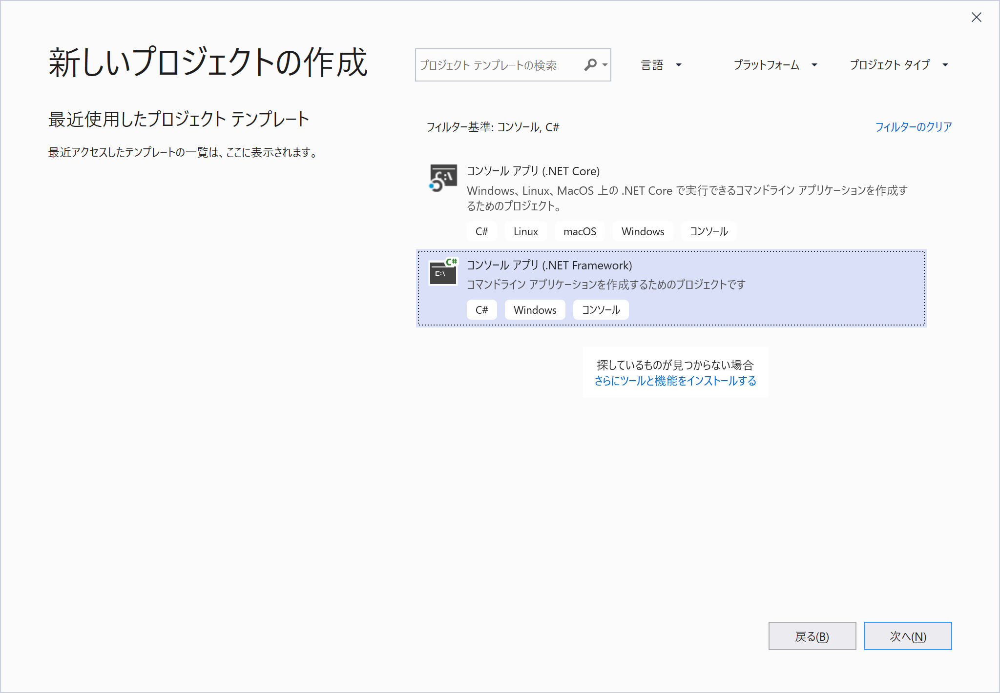
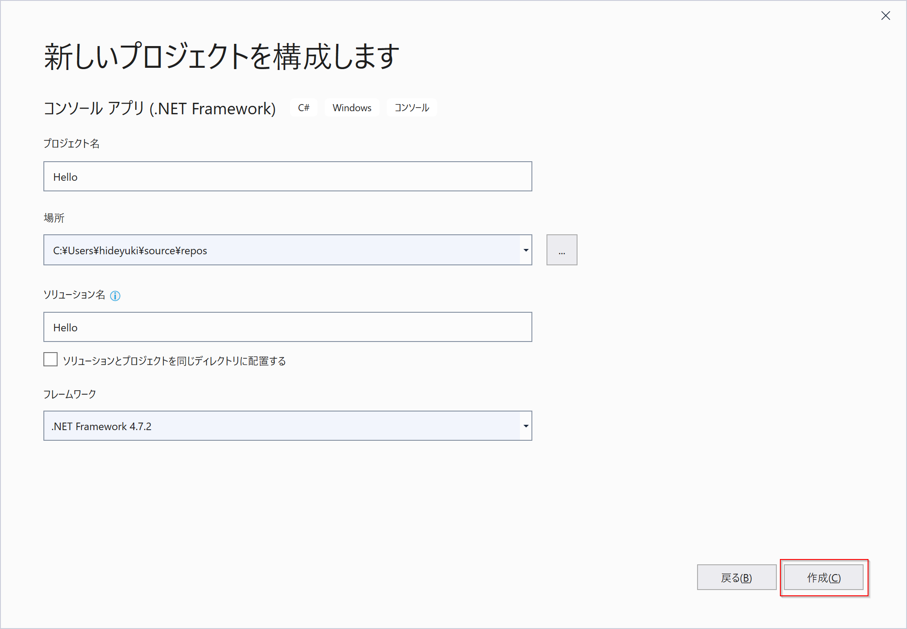
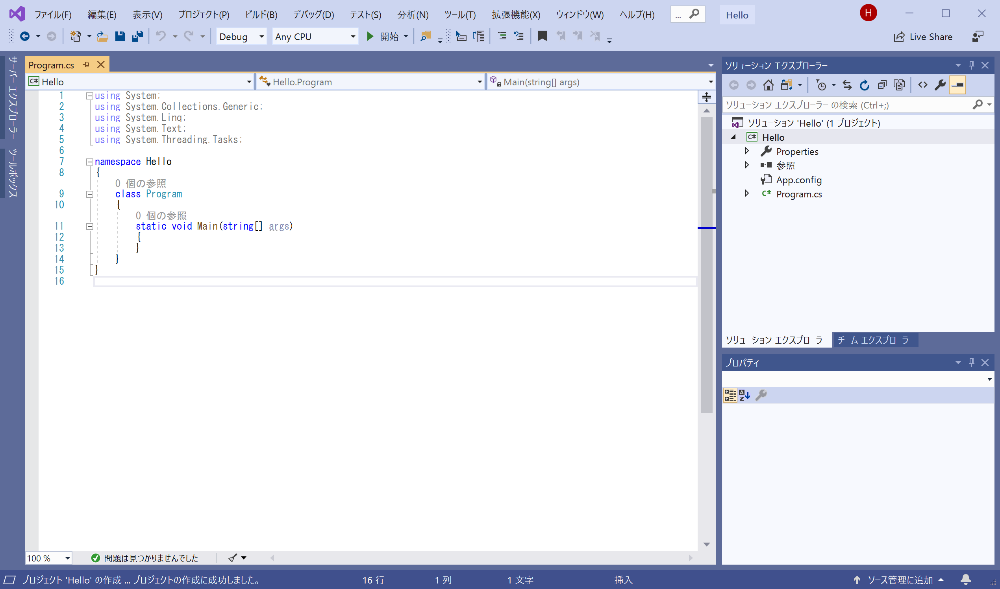
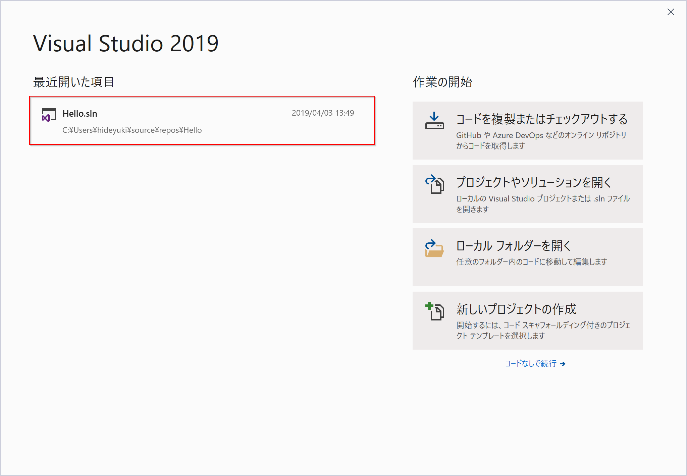

# Visual Studio 2019 でのプロジェクトの作成手順

## はじめに

本手順は、書籍『新・標準プログラマーズライブラリ なるほどなっとくC#入門』(技術評論社)の読者のための補助資料として公開するものです。

本文では説明できなかった、Visual Studio Community 2019 のプロジェクトの新規作成および既存プロジェクトのオープン方法について説明しています。

## 新しいプロジェクトを作成する

1. スタートメニューからVisual Studio 2019を起動します。

    

2. 以下のようなウインドウが開きます。ここで、\[新しいプロジェクトの作成\]をクリックします。

    

3. 新しいプロジェクトの作成ダイアログが開きますので、ダイアログ上部の\[言語\]欄から`C#`を選択します。

    

4. 続いて、\[プロジェクトタイプ\]欄で、作成したいプロジェクトのタイプを選択します。ここでは`コンソール`を選択します。

    

    必要ならば、\[プラットフォーム\]欄で、対象のプラットフォームを選択してください。

5. 選択した言語とプロジェクトタイプに合致したプロジェクトテンプレートの一覧が表示されますので、`コンソールアプリ(.NET Framework)`をクリックし、\[次へ\]ボタンをクリックします。

    

    ウィンドウ左側には、「最近使用したプロジェクトテンプレート」の一覧が表示されます。ここで作成したいテンプレートを選んでもOKです。

5. \[新しいプロジェクトを構成します\]ダイアログが表示されます。ここで、プロジェクト名欄にプロジェクト名を入力し、\[作成\]ボタンをクリックします。

    

5. 新しいプロジェクトが作成され、以下のようなウィンドウが表示されます。

    

    これで、新しいプロジェクトの作成が終わりました。

## 既存プロジェクトを開く

保存したC#のプロジェクトを開いて、プログラミングを再開する手順を説明します。

1. スタートメニューからVisual Studio 2019を起動します。

    

2. 以下のウィンドウが開きます。左側領域に、最近開いたプロジェクトの一覧が表示されます。開きたいプロジェクトをマウスでクリックします。

    

3. 選択したプロジェクトが開き、以下のようなウィンドウが表示されます。

    

    これで、保存したプロジェクトのプログラミングを再開できます。
